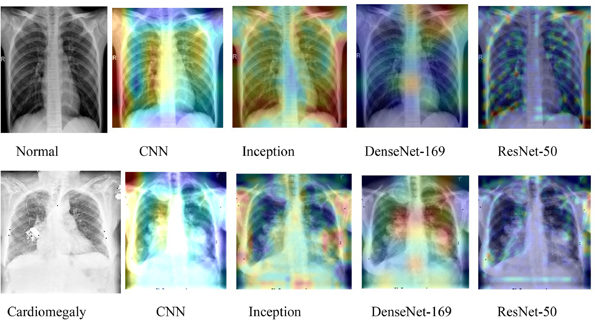
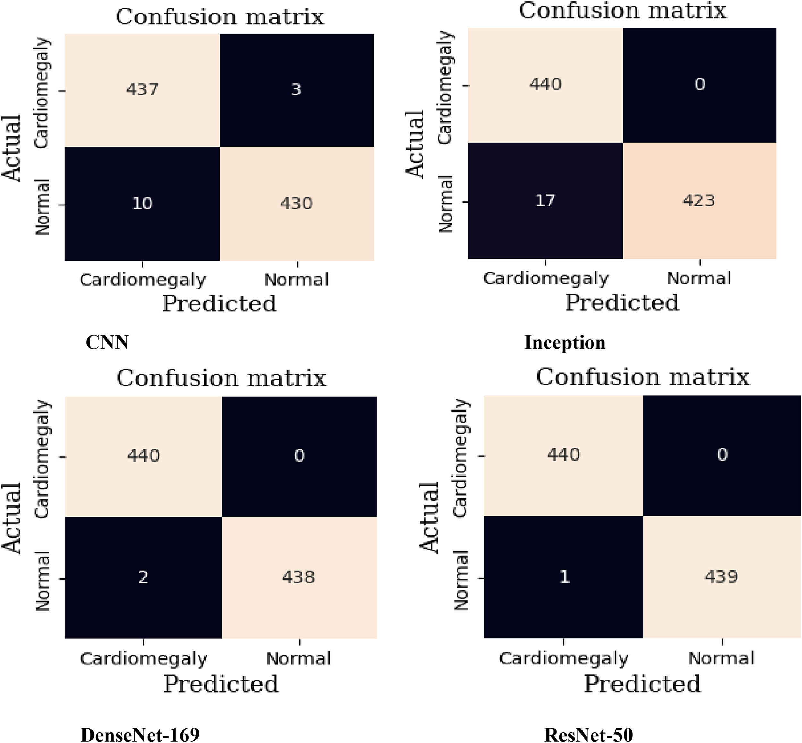

## Cardiomegaly detection and classification from X-ray images using CNN and transfer learning

This repository contains the source code and experimental notebooks for the research paper:

**Title:** _Early-stage cardiomegaly detection and classification from X-ray images using convolutional neural networks and transfer learning_   
**Published in:** [Intelligent Systems with Applications, Elsevier (2024)](https://www.sciencedirect.com/science/article/pii/S2667305324001273)  
**DOI:** [10.1016/j.iswa.2024.200453](https://doi.org/10.1016/j.iswa.2024.200453)

### Objective

To detect and classify early-stage cardiomegaly from chest X-ray images using deep learning models, including CNN and transfer learning with pre-trained architectures (VGG19, Inception, DenseNet-169, ResNet-50).

### Notebooks included

- `Cardiomegal_Detection_VGG19.ipynb`: Implements VGG19 for feature extraction and classification.
- `Cardiomegaly_before_preprocessing.ipynb`: Baseline CNN experiment before image preprocessing.
- `Final_CNN_Cardiomegaly_before_preprocessing.ipynb`: Final version of the custom CNN without preprocessing.
- `Final_DenseNet169_Cardiomegal.ipynb`: DenseNet-169 with enhanced preprocessing (BM3D, CLAHE).
- `Inception_After_preprocessing_Cardiomegal_Detection.ipynb`: Inception-based model after preprocessing.

### Key methods used

- **Preprocessing:** CLAHE for contrast enhancement and BM3D for noise reduction.
- **Models:** CNN, VGG19, Inception, DenseNet-169, and ResNet-50.
- **Evaluation Metrics:** Accuracy, Precision, Recall, F1-Score, Confusion Matrix.
- **Visualization:** Grad-CAM to highlight image regions influencing model decisions.

### Important results and plots

- ResNet-50 achieved **100% training & validation accuracy**, and **99.8% test accuracy**.
- CNN achieved **98.5% test accuracy**, showcasing the value of preprocessing.
- Grad-CAM visualizations (see Fig. 13 in the paper) reveal model attention areas.
- Confusion matrices demonstrate very low misclassification rates across all models.

<p align="center"> Visualization of significant regions in the CXR images using Grad-Cam
  
</p>

<p align="center"> Confusion matrix of the different proposed cardiomegaly detection models
  
</p>

> Note: For full details on dataset preparation, training setup, and hyperparameters, refer to the paper.

### Citation

If you use this code or reference the methodology in your research, please cite our paper:

```bibtex
@article{Ayalew2024Cardiomegaly,
  title={Early-stage cardiomegaly detection and classification from X-ray images using convolutional neural networks and transfer learning},
  author={Ayalew, Aleka Melese and Enyew, Belay and Bezabh, Yohannes Agegnehu and Abuhayi, Biniyam Mulugeta and Negashe, Girma Sisay},
  journal={Intelligent Systems with Applications},
  volume={24},
  year={2024},
  pages={200453},
  publisher={Elsevier},
  doi={10.1016/j.iswa.2024.200453}
}

